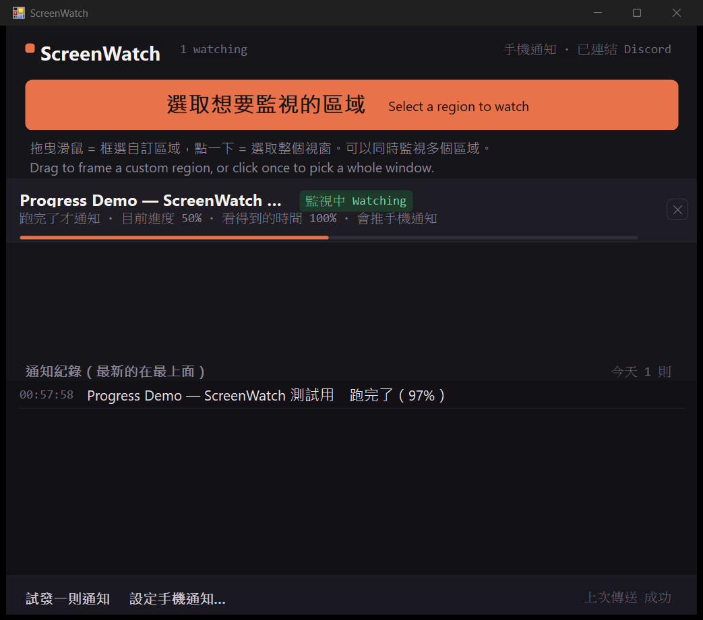

# SCMWC

**框住螢幕任何一塊，變了就通知你。**

不管那塊畫面屬於哪個程式 —— Citrix、SAP、公司內部老系統、瀏覽器後台、算圖進度 ——
它只看畫素，不需要跟任何程式整合。

*Watch any region of your screen and get notified when it changes.
Works with any application, because it only looks at pixels.*

官網：**https://scmwc.pages.dev**（[中文](https://scmwc.pages.dev/zh)）

## 下載

**[⬇ 下載最新版本](../../releases/latest)**

Windows 10 / 11 · 約 140 KB · 不需要管理員權限

目前所有功能免費開放，沒有使用期限，沒有廣告，也不蒐集任何資料。

## 下載後 Windows 會跳警告，這是正常的

這個版本還沒有購買程式碼簽章憑證，所以 Microsoft Defender SmartScreen 會顯示
「Windows 已保護您的電腦」。那代表「這個檔案還沒累積足夠的下載信譽」，
不代表它被判定為惡意程式。

1. 點「其他資訊」
2. 再點「仍要執行」

不放心的話可以先把安裝檔上傳到 [VirusTotal](https://www.virustotal.com/) 掃描。
簽章憑證會在之後補上。

## 能做什麼

| 功能 | 說明 |
| --- | --- |
| 中英雙語 | 介面會跟著 Windows 顯示語言自動切換，也可以手動指定 |
| 五種通知條件 | 畫面有變化、進度條跑完、跑到指定 %、顏色變了、停下來了 |
| 不是長條的進度也能看 | 像「上傳中 22%」這種純文字、轉圈圈、一直捲的訊息，改用「停下來就通知我」 |
| 自己找出進度條 | 直接框整個視窗就好，程式會在範圍裡找出那條進度條 |
| 同時監視多個區域 | 每個區域各自設定條件與檢查頻率 |
| 推播到手機 | 接上 Discord webhook，人不在電腦前也收得到 |
| 最小化也繼續看 | 最小化的視窗不會繪製，所以程式會把它移到背景繼續監視 |
| 不會靜默失效 | 抓不到畫面時會明講原因，那段時間也會從「看得到的時間」扣掉 |

「進度條跑完」是邊緣觸發 —— 跑完只響一次，不會停在 100% 一直吵。
就算進度條跑滿後立刻歸零重跑也抓得到。

## 你應該知道的事

**它會移動你的視窗。** 被監視的視窗一旦最小化，程式會把它還原並移到螢幕可見範圍之外，
以便繼續擷取畫面。可以隨時從系統匣選單放回來，關閉程式時也會自動還原。

**「跑完了」是推論。** Windows 的進度條填滿時帶有動畫，若程式完成後立即重設，
畫面上可能從未出現完整填滿的狀態。這時程式會依「進度大幅倒退」推論已完成，
有可能把失敗重試誤判為跑完。

**不要用在關鍵用途。** 這是便利工具，不是監控系統也不是警報系統。
醫療、工安、消防、交通、自動交易等「沒收到通知就可能出事」的場景請不要使用。

**手機推播會把資料送到 Discord。** 啟用後，視窗標題與觸發原因會傳到你指定的頻道。
附上截圖的選項預設關閉。在公司環境使用前請自行確認合規。

**有些畫面抓不到。** 全螢幕遊戲、有版權保護的影片視窗不允許其他程式讀取畫面。
這種情況清單上會顯示「看不到畫面」並說明原因。

完整條款見 [使用條款與免責聲明](EULA.txt)，安裝時也會顯示並需要你同意。

## 系統需求

| | |
| --- | --- |
| 作業系統 | Windows 10 1607 以上 / Windows 11 |
| 相依套件 | .NET Framework 4.x（Windows 內建） |
| 安裝位置 | `%LOCALAPPDATA%\Programs\SCMWC` |
| 設定檔 | `%LOCALAPPDATA%\SCMWC\config.txt`，解除安裝時一併刪除 |
| 資料蒐集 | 沒有。除了你自己設定的 Discord 推播之外不對外連線 |

## 回報問題

請開 [Issue](../../issues)，附上：

- Windows 版本
- 被監視的是什麼程式
- 清單那一列顯示的完整文字（包含狀態和原因）

---

與 Microsoft、Discord 及任何被監視的軟體均無關聯。
